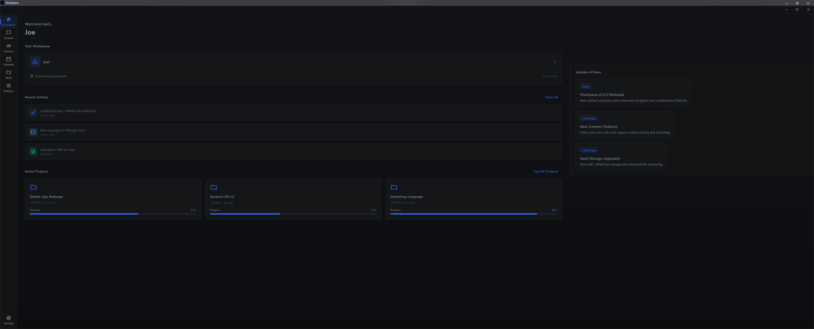
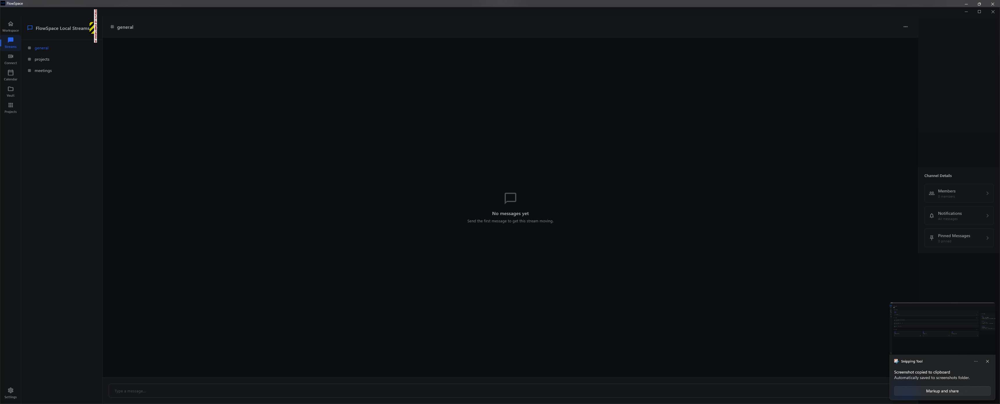
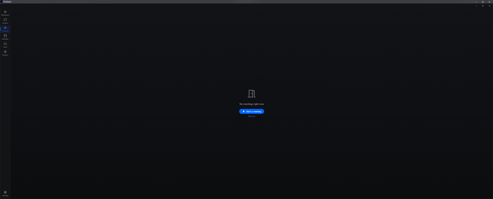
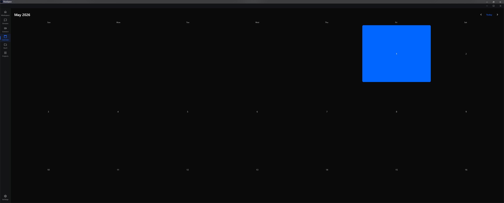
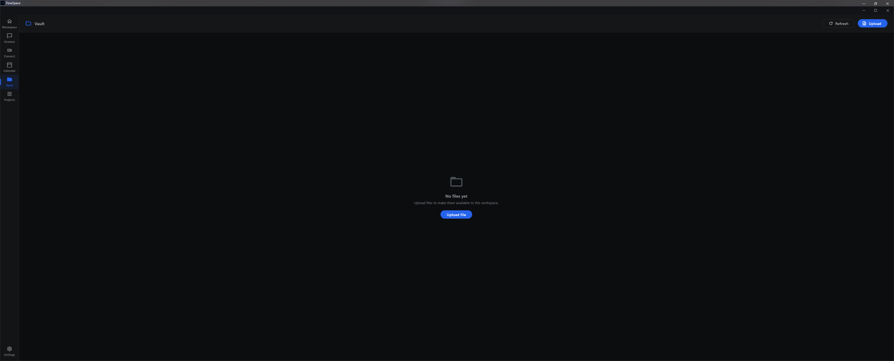
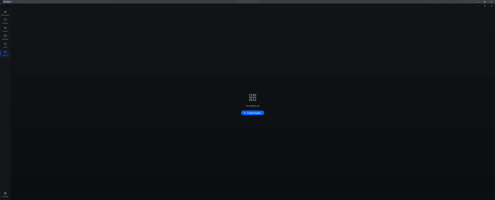

# FlowSpace

FlowSpace is a private company collaboration app aimed at the same day-to-day jobs as Slack, Microsoft Teams, and Zoom: workspace navigation, streams, meetings, calendar, file vault, and project coordination in one cross-platform experience.

## Current Direction

FlowSpace is staying local-first for now, while keeping the app architecture cross-platform.

The local app is intended to run across Windows, macOS, Linux, and eventually iOS from the same Flutter codebase. Windows is the current development and validation machine, but macOS and Linux desktop targets are already present in the repo, and the iOS target remains part of the product direction.

Local accounts, workspaces, starter channels, and offline session state are stored on the machine so the app can be used without standing up the backend stack. The backend services remain in the repository for future hosted sync, production auth, and multi-device infrastructure, but local/offline operation is the baseline until the app experience is stable.

Default seeded local login:

```text
Email: local@flowspace.app
Password: flowspace123
```

You can also create a local account from the app. When the API is unavailable, registration falls back to the local SQLite store and future logins verify against that local account.

## Screenshots

### Workspace Home



### Streams



### Connect



### Calendar



### Vault



### Projects



## What Works Locally

- Local account creation and login
- Local workspace bootstrap
- Starter streams: `general`, `projects`, and `meetings`
- Workspace dashboard shell
- Streams layout and message composer surface
- Connect/meeting entry surface
- Calendar view
- Vault upload surface
- Projects entry surface
- Windows desktop build
- macOS and Linux desktop project targets
- iOS project target for future mobile validation

## Tech Stack

Frontend:

- Flutter and Dart
- Windows, macOS, and Linux desktop targets
- iOS target for the future mobile app
- Local SQLite cache/store through `sqflite_common_ffi`
- Secure platform storage through `flutter_secure_storage`

Backend, retained for future hosted mode:

- NestJS
- Prisma
- PostgreSQL
- Redis
- Socket.IO
- MinIO
- LiveKit

## Run Locally

From the Flutter client on the current platform:

```bash
cd client_flutter
flutter pub get
flutter run -d windows   # Windows
flutter run -d macos     # macOS
flutter run -d linux     # Linux
```

To build the current desktop app:

```bash
cd client_flutter
flutter build windows --debug   # Windows
flutter build macos --debug     # macOS, requires Xcode
flutter build linux --debug     # Linux
```

The Windows debug executable is created under:

```text
client_flutter/build/windows/x64/runner/Debug/client_flutter.exe
```

## Windows Helper Scripts

Windows setup, packaging, installer, service, and verification scripts are kept out of the repo root under:

```text
scripts/windows/
```

Run them from the repository root so their existing relative paths continue to resolve correctly:

```powershell
.\scripts\windows\verify.ps1
.\scripts\windows\dev-server.ps1
.\scripts\windows\START_HERE.ps1
```

## Validation

Useful checks before pushing:

```powershell
cd client_flutter
flutter test --no-pub
flutter analyze --no-fatal-warnings --no-fatal-infos
flutter build windows --debug --no-pub
```

The analyzer currently exits successfully with non-fatal warning/info debt. Treat that lint debt as cleanup work, not as a blocker for the local-first pass.

## Repository Layout

```text
FlowSpace/
  backend/                  NestJS API and future hosted services
  client_flutter/           Flutter desktop/mobile app
  documents/                Archived implementation notes and guides
  docs/                     Planning docs and screenshots
  infrastructure/           Service configs for hosted development
  scripts/windows/          Windows helper scripts and packaging tools
  service-wrappers/         Windows service helper scripts
```

## Near-Term Focus

1. Keep the desktop app usable in offline/local mode.
2. Fill empty states with real local data flows.
3. Make Streams, Vault, Calendar, Connect, and Projects useful without backend dependencies.
4. Keep Windows, macOS, Linux, and iOS targets healthy as features are added.
5. Reduce visual/layout issues shown by the current screenshots.
6. Reintroduce hosted backend sync only after the local app feels coherent and reliable.
